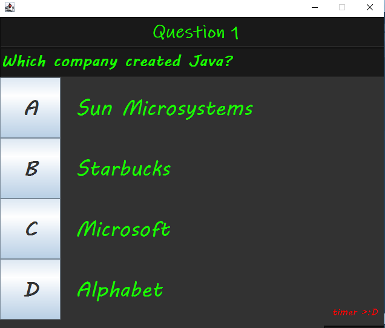
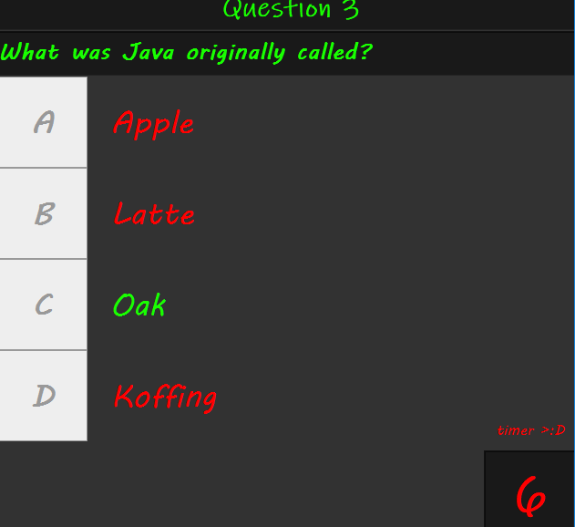
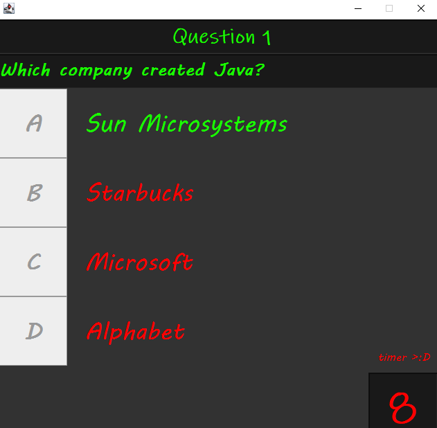
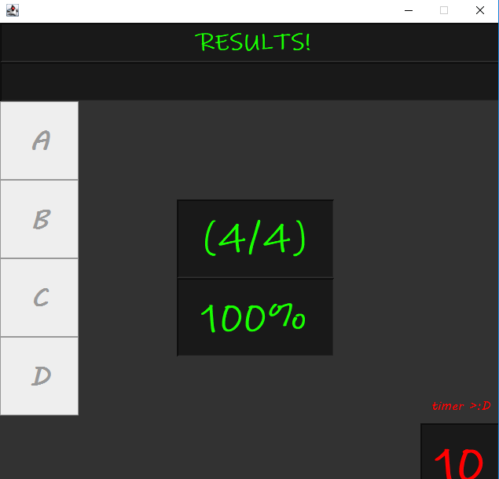

# Java_QuizGame

This is an interactive game which is implemented using Java Swing.

# Functionality

- [x] User can select one of the answer from multiple choice questions.
 
- [x] Application has different multiple choices questions.

- [x] User have to answer questions in a limited time, and the score and assessment are shown according to your answers.

- [x] When user end the quiz, their score distribution will be shown.

# Screenshots

# AUTHOR
Jinal Kalpesh Shah

# DEMO
Download the QuizGame.jar Jar file and double click to run

Or run java -jar QuizGame.jar from the command line

